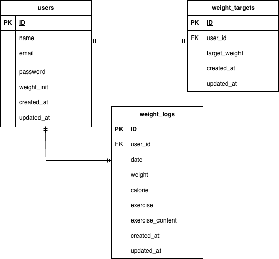

# pigly

##環境構築

### Dockerビルド

1. git clone https://github.com/shiroyama373/pigly.git
2. docker-compose up -d --build

＊ MySQL は OS によって起動しない場合があります。その場合は、docker-compose.yml ファイルを編集し、それぞれの PC に合わせて調整してください。

### Laravel 環境構築

1. docker-compose exec app bash
2. composer install
3. cp .env.example .env
※ 必要に応じて .env のDB設定を docker-compose.yml に合わせて変更
4. php artisan key:generate
5. php artisan migrate --seed
6. php artisan storage:link

### 使用技術
- PHP: 8.3.24
- Laravel: 10.49.1
- MySQL: 8.0.43

## URL

 - 開発環境（アプリ）: http://localhost:8000
 - phpMyAdmin: http://localhost:8082

## ER 図

ダミーデータについて

開発や動作確認用に、初期データ（ダミーデータ）を用意しています。
php artisan db:seed を実行すると、以下の内容がデータベースに挿入されます。

- ユーザー情報
	-	ファイル: database/factories/UserFactory.php
	-	初期ユーザー例:
	-	メールアドレス: test@example.com
	-	パスワード: password
	-	ランダムな体重データも生成されます

- 体重ログ
	-	ファイル: database/factories/WeightLogFactory.php
	-	ユーザーごとの体重、摂取カロリー、運動時間・内容などのログを生成

- 目標体重
	-	ファイル: database/factories/WeightTargetFactory.php
	-	ユーザーごとの目標体重を生成

これらのダミーデータを使うことで、ログイン確認や体重管理画面の動作確認がすぐにできます。
